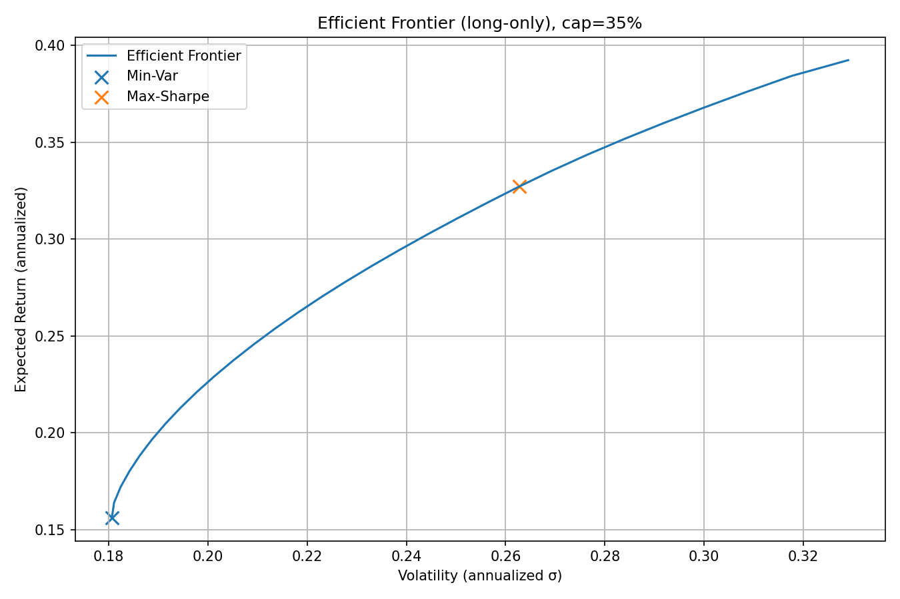
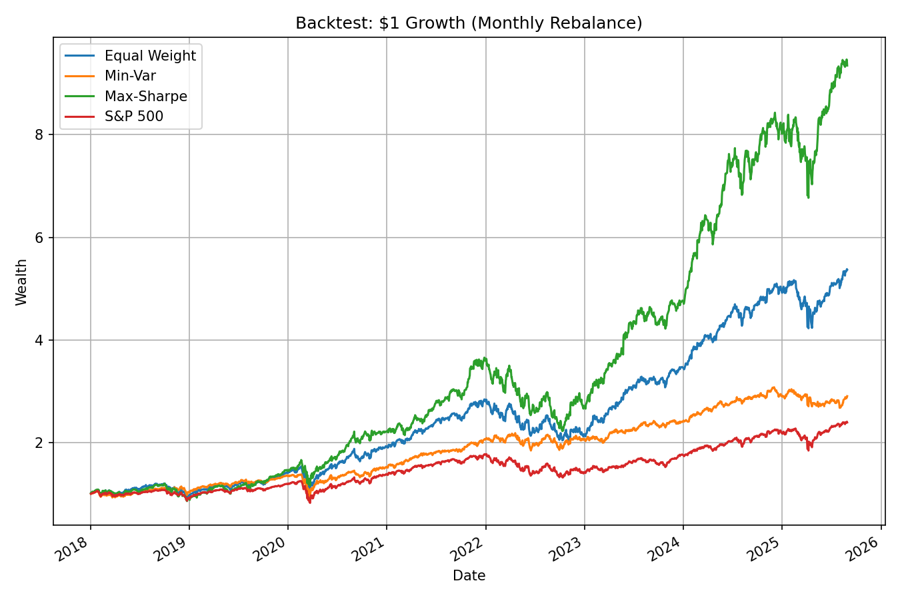
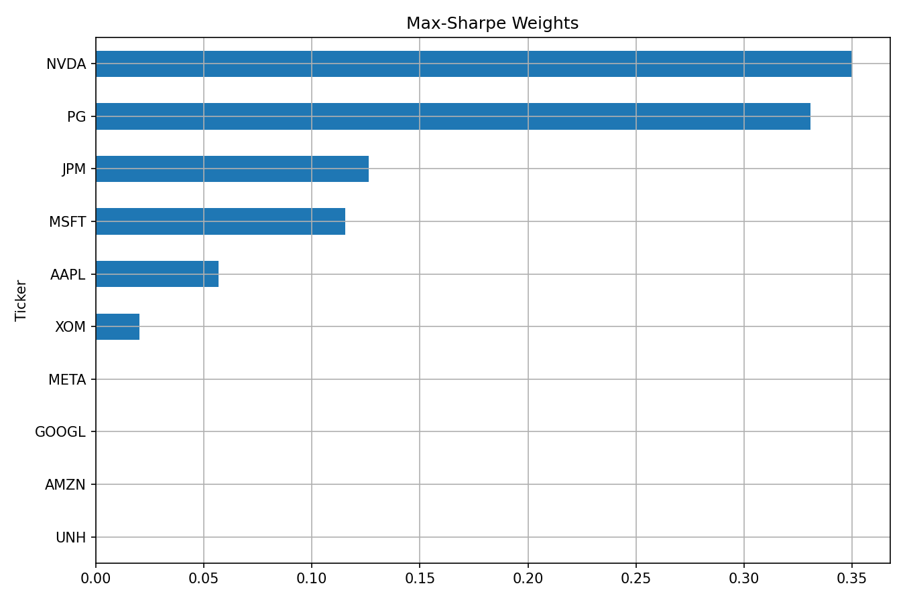

# Portfolio Optimization & Backtest (Python, cvxpy)

This project implements a **mean–variance portfolio optimizer** over 10 U.S. equities using Python.  
It constructs:
- **Max-Sharpe portfolio** (highest risk-adjusted return)  
- **Min-Variance portfolio** (lowest volatility)  
and compares them to an **Equal-Weight portfolio** and the **S&P 500** benchmark.

---

## Efficient Frontier

## Backtest Results (2018–2025)

## Max-Sharpe Weights

---

## Performance Summary
| Portfolio      | Ann.Return | Ann.Vol | Sharpe | MaxDD |
|----------------|-----------:|--------:|-------:|------:|
| Equal Weight   | 24.63%     | 23.08%  | 1.07   | -31.58% |
| Min-Variance   | 15.01%     | 18.03%  | 0.86   | -31.01% |
| Max-Sharpe     | 34.00%     | 26.27%  | 1.25   | -39.06% |
| S&P 500        | 12.13%     | 19.89%  | 0.61   | -33.92% |

---

## Quick Summary
- **Max-Sharpe Portfolio** (top allocations: NVDA 35%, PG 33%, JPM 13%)  
  - Return: **32.7%**, Vol: **26.3%**, Sharpe: **1.25**  
- **Min-Variance Portfolio** (top allocations: PG 35%, XOM 20%, UNH 14%)  
  - Return: **15.6%**, Vol: **18.1%**, Sharpe: **0.86**

---

### How to Run
1. Open [`portfolio_optimizer.ipynb`](./portfolio_optimizer.ipynb) in **Google Colab**.  
2. Click **Runtime → Run all**.  
3. All plots and performance tables will be generated automatically.
